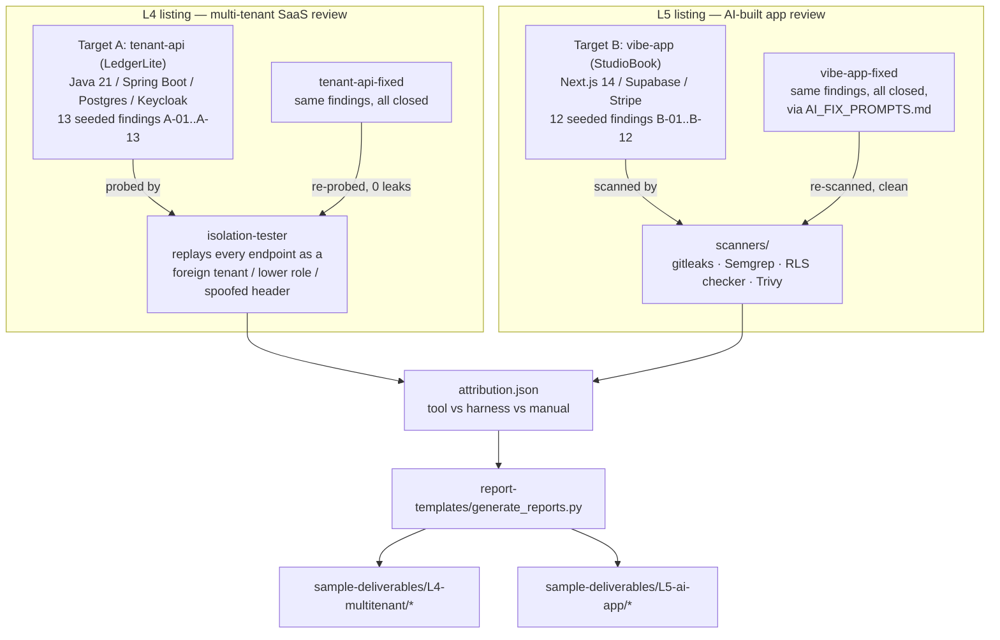

# saas-security-review-lab

[](https://github.com/muralikalluri/saas-security-review-lab/actions/workflows/ci.yml)
[](LICENSE)

> Deliberately insecure for demonstration and training. Do not deploy. Run locally only.

Two deliberately vulnerable SaaS apps, a tenant-isolation testing harness that finds
cross-tenant leaks automatically, a Supabase RLS checker plus a small scanner suite, and
sample security reports where every finding has evidence, impact, fix, effort, and (for
the AI-app-review listing) a ready-to-paste AI fix prompt - the exact prompt actually
used to produce this repo's own fixed branch, not a hypothetical one.

This is the working proof behind two Upwork listings: **L4** (multi-tenant SaaS security
review with tenant isolation testing) and **L5** (security & code review of an AI-built
app with a fix plan).

## Demo

_Screen recording not yet captured - `npm run dev` / `docker compose up` walkthroughs are
below in Quickstart; a short demo GIF is on the list before this goes live on Upwork._

## Results

Every number below is checked against a committed, generated results file (see the
Source column to reproduce it yourself) - this table itself is prose, so re-verify
before trusting it over the file it cites.

| Metric | Result | Source |
|---|---|---|
| Target A findings with a fix commit in `tenant-api-fixed` | 13 / 13 | `sample-deliverables/L4-multitenant/SECURITY_REVIEW_FULL.md`'s per-finding `Diff:` line (all 13 point to the same commit - M3 fixed Target A in one commit, not one-per-finding) |
| Isolation-tester non-control probes vs. baseline | 115 probes, 58 classified LEAK, confirming A-01..A-07 | `results/isolation-tester/baseline/isolation-matrix.md` |
| Isolation-tester non-control probes vs. fixed mode | 115 probes, **0 LEAK**, exit 0 (`pytest`: 109 passed, 0 failed) | `results/isolation-tester/fixed/isolation-matrix.md` |
| Target B findings with a fix commit in `vibe-app-fixed` | 12 / 12 (7 of the 12 cite two commits - a follow-up landed after a milestone review found the first incomplete) | `sample-deliverables/L5-ai-app/REVIEW_WITH_FIX_PLAN.md`'s per-finding `Diff:` line - a real `git log` lookup per finding id, not asserted |
| Supabase RLS checker vs. `vibe-app` baseline | 2 FAIL (`bookings`, `profiles` - B-03, B-04) | `scanners/results/rls-checker/vibe-app/rls-matrix.md` |
| Supabase RLS checker vs. `vibe-app-fixed` | 0 FAIL | `scanners/results/rls-checker/vibe-app-fixed/rls-matrix.md` |
| gitleaks vs. `vibe-app-fixed`'s tracked source | 0 hits | `scanners/results/gitleaks/vibe-app-fixed-tree.md` |
| Semgrep vs. `vibe-app-fixed`'s tracked source | 0 findings | `scanners/results/semgrep/vibe-app-fixed.json` |
| Findings by discovery method (25 total, A+B) | 7 harness · 6 tool · 12 manual | `scanners/results/attribution.md` |
| Dependency scan | 3 manifests (Trivy): `tenant-api`, `tenant-api-fixed` (has an extra dependency, Bucket4j), `vibe-app` - `vibe-app-fixed` shares an identical lockfile with `vibe-app` (only `name`/scripts differ), so it isn't separately re-scanned | `scanners/results/dependency-scan/*.json` |

All 13 `targets/tenant-api/exploits/A-*.sh` scripts and all 12
`targets/vibe-app/exploits/B-*.sh` scripts were re-run by hand against freshly-reset
stacks while preparing this README, confirming each one reproduces its seeded flaw on
baseline. The same A-series scripts (pointed at the fixed API via `API_BASE`, and for
A-11 also `API_SERVICE`/`DB_SERVICE` - see `targets/tenant-api-fixed/README.md`) and
B-series scripts (`targets/vibe-app-fixed/exploits/`) confirmed the fixed behaviour
instead, for all 13 and all 12 respectively - except A-09, which greps the committed
`application.yml` directly (there's no live request that proves a hardcoded secret's
absence) so it can't be pointed at a different target at all; its fixed-mode evidence is
gitleaks finding 0 hits in `tenant-api-fixed`'s tracked source instead (see the Results
table above) plus the file itself showing no default `DB_PASSWORD` fallback. None of this
hand-verification is captured to a committed results file the way the rows above are, so
re-run them yourself (e.g. `for f in targets/vibe-app-fixed/exploits/B-*.sh; do ./"$f";
done`) rather than trusting this paragraph alone.

## Architecture



## Quickstart

**Target A (tenant-api, baseline vs. fixed):**

```bash
cp .env.example .env
docker compose up -d --build
curl http://localhost:8183/actuator/health          # baseline
curl http://localhost:8184/actuator/health           # fixed
cd targets/tenant-api/exploits && ./A-01-bola-invoice-by-id.sh   # reproduces the leak
```

**Target B (vibe-app, baseline) - run in one terminal:**

```bash
# .env is already committed here (that IS finding B-02) - no copy step needed
cd targets/vibe-app
supabase start && npm install && npm run dev
```

Then, in a second terminal, with the dev server above still running:

```bash
cd targets/vibe-app/exploits
./B-01-service-role-key-in-client-bundle.sh   # reproduces the leak
```

**Target B (vibe-app-fixed) - a separate terminal, separate Supabase project:**

```bash
cd targets/vibe-app-fixed
cp .env.example .env   # fill in ANON_KEY/SERVICE_ROLE_KEY from `supabase start`'s own output
supabase start && npm install && npm run dev
```

**Isolation-tester** (its own `.venv` first: `cd isolation-tester && python3 -m venv .venv
&& .venv/bin/pip install -r requirements.txt`, then from inside `isolation-tester/`):

```bash
.venv/bin/python -m isolation_tester run \
  --config config/tenant-api.baseline.yaml --openapi openapi/tenant-api.isolation.yaml \
  --run-name baseline --expect expectations/tenant-api.baseline.yaml
```

**Scanners** (from the repo root - a separate command, needs PyYAML, gitleaks and semgrep on PATH):

```bash
python3 scanners/verify_expected.py    # gitleaks + Semgrep + attribution, no live stack needed
```

See each target's own README for full setup, and `docs/method.md` for the review
methodology behind the sample deliverables.

## Features

- **Two realistic, deliberately-vulnerable targets** - a Java/Spring multi-tenant B2B API
  and a Next.js/Supabase/Stripe "AI app builder"-style app - each with a genuinely
  separate **fixed** counterpart (own database/project, never the same process as the
  baseline), so before/after is a real diff, not a toggle.
- **A reusable tenant-isolation test harness** (`isolation-tester/`) - not a fuzzer,
  a targeted replay of every endpoint as the wrong tenant/role/header, with
  request/response evidence saved per probe and a CI-usable exit code.
- **A purpose-built Supabase RLS checker** (`scanners/rls-checker/`) that reads the live
  Postgres catalog (not a regex over migration SQL) to correctly classify row-level
  security posture - including the Postgres semantics a naive checker gets wrong
  (`WITH CHECK` falling back to `USING`, per-role restrictive-policy scoping, the
  underlying-GRANT requirement).
- **A small scanner suite** (gitleaks with 3 custom rules, 2 custom Semgrep rules, Trivy)
  with a generated tool-vs-manual attribution report - not a marketing claim about method,
  an actual computed breakdown.
- **12 AI fix prompts, actually used** - `targets/vibe-app-fixed/AI_FIX_PROMPTS.md` was
  written before any fix, then applied one commit per finding; the sample deliverable's
  "AI fix prompt" field is that same prompt, not a fresh one written for the report.
- **Generated, not hand-typed, sample deliverables** - `report-templates/generate_reports.py`
  computes every count (severity totals, probe counts, tool-attribution) from the actual
  results files; PDF export via Pandoc + Tectonic.

## Design decisions

- **Fixed mode is a separate app/database/project, never a runtime toggle.** A shared
  codebase with an `if (fixed)` branch would mean the "vulnerable" path silently rots as
  soon as anyone edits the "fixed" one. Two independent apps means the baseline is
  guaranteed byte-for-byte stable, and the fixed one can be reviewed as a real diff.
- **The isolation-tester classifies by replaying, not by asserting.** Every probe records
  an actual request/response pair as evidence rather than a pass/fail assertion alone -
  the point of the tool is to be independently checkable, not just self-reported.
- **The RLS checker reads the live catalog, not the migration files.** Migrations are
  applied in order and can be superseded; only the replayed, final catalog state
  (`pg_class`, `pg_policies`, `has_table_privilege`) is trustworthy. This caught a real
  bug during development: Supabase's default ACLs grant broad table/function privileges
  to `authenticated` on every new object, which a checker trusting the migration source
  alone would miss entirely.
- **Attribution is computed from each tool's own declared output, not proximity.** An
  early version of the attribution script credited a finding if any tool hit landed
  within N lines of that finding's comment - too coarse, since a heuristic Semgrep rule
  legitimately also fires on unrelated, similarly-shaped code nearby. The final version
  only credits a finding when the specific tool/rule declares that exact target
  (`metadata.finding`, a gitleaks rule's `tags`, or the RLS checker's own verdict fields).
- **Every generated number cites its source file.** Report counts, matrix results, and
  this README's own Results table are all reproducible by re-running the script or tool
  that produced them - never asserted from memory.

## Sample deliverable

[`sample-deliverables/L5-ai-app/REVIEW_WITH_FIX_PLAN.md`](sample-deliverables/L5-ai-app/REVIEW_WITH_FIX_PLAN.md)
([PDF](sample-deliverables/L5-ai-app/REVIEW_WITH_FIX_PLAN.pdf)) - the full 12-finding
report for Target B, including the actual AI fix prompt used for each finding and a
sprint-grouped remediation plan. See `sample-deliverables/` for all 4 deliverables
(2 per listing, Starter and Standard/Advanced tiers).

## Documentation

- [`SPEC.md`](SPEC.md) — full specification, seeded findings, milestone plan
- [`docs/method.md`](docs/method.md) — review methodology (manual + automated)
- [`report-templates/README.md`](report-templates/README.md) — how the sample deliverables are generated
- Each target/tool directory has its own README with setup and verification steps

## MVP status

Milestones M0–M7 (`SPEC.md` §7) are implemented. M8 ("CI job running isolation tester
against fixed mode on every push") is explicitly out of MVP scope ("Later" in `SPEC.md`
and `CLAUDE.md`) and not implemented - the CI workflow's isolation-tester job only runs
the harness's own offline unit tests, never a live run against a deployed stack.

Everything else was re-verified while preparing this README, not just read from old
results:

- **M0** - banners present in every required file, `docker compose config` valid,
  `docker compose build`/`up` succeed for both `api` and `api-fixed`.
- **M1** - all 13 `targets/tenant-api/exploits/A-*.sh` scripts reproduce their seeded
  flaw against a freshly-reset baseline (Docker volume wiped, Flyway re-seeded).
- **M2/M3** - the isolation-tester confirms A-01..A-07 on a fresh baseline (58 LEAK / 115
  non-control probes) and is fully green on fixed mode (0 LEAK, `pytest`: 109 passed, 0
  failed) - re-run twice on independently fresh databases for reproducibility, not just
  read from the committed file (see the note below - the previously-committed numbers
  turned out to be stale).
- **M4** - all 12 `targets/vibe-app/exploits/B-*.sh` scripts reproduce their seeded flaw
  against a freshly-reset baseline.
- **M5** - `scanners/verify_expected.py` passes (gitleaks, Semgrep, attribution counts);
  the RLS checker correctly reports 2 FAIL against `vibe-app` baseline (B-03, B-04) and 0
  FAIL against `vibe-app-fixed`; its own unit tests pass (24/24 full suite, 22/22 in CI's
  narrower scope).
- **M6** - all 12 B-series exploit scripts confirm FIXED against a freshly-reset
  `vibe-app-fixed`; `tsc`/`npm run build`/`npm test` all clean; all 10 migrations apply
  cleanly on `supabase db reset`.
- **M7** - all 4 sample deliverables regenerate cleanly and export to PDF with no
  meaningful overflow (a few points on two pages, not the eye - see
  `report-templates/README.md`).

**One thing this pass corrected, not just verified:** the committed
`results/isolation-tester/{baseline,fixed}/isolation-matrix.json` dated from the original
M3 commit and turned out not to be reproducible from a clean database - two independent
fresh runs both gave a smaller, but internally consistent, probe count (115 non-control
vs. the previously-committed 185) with the *same* findings confirmed either way
(A-01..A-07 - no seeded flaw was accidentally closed, only the denominator was stale).
Root cause and full details in that fix's own commit message.

### Known gaps, found while preparing this release

1. **`mvn verify`'s Testcontainers-based integration tests could not be run in this local
   environment.** `TenantApiApplicationTests` and `TenantIsolationFlawsTest` (both
   modules) fail with "Could not find a valid Docker environment" against this machine's
   Docker Desktop + Testcontainers 1.20.1 combination, even though `docker compose
   build`/`up` work fine and `mvn package -DskipTests` succeeds cleanly for both modules.
   This looks like a local macOS-specific compatibility issue, not a code defect - the
   same functional behaviour (tenant isolation broken on baseline, closed on fixed) was
   independently confirmed instead via the live exploit scripts and isolation-tester runs
   against real running containers, described above. CI runs this job on Linux
   GitHub-hosted runners, where this specific failure mode is not expected to reproduce,
   but that hasn't been confirmed by an actual run (see #2).
2. **This repository has not been pushed to GitHub yet.** The CI badge above points at a
   workflow that has never run against this code - the local `main` branch is 25 commits
   ahead of `origin/main` with nothing pushed. Every check that workflow performs was
   instead run locally in this pass (the M0–M7 list above) as a substitute, so "CI green"
   is not yet a claim backed by an actual GitHub Actions run.
3. **Portfolio checklist gaps.** `SPEC.md` §3 asks for a screenshot of both isolation
   matrices; the repo's own README-order convention calls for a demo GIF (see Demo,
   above) - neither has been captured yet, and the "Hire me" link below is still a
   placeholder (no real Upwork profile URL supplied yet). These need a human in the loop
   - recording a walkthrough/screenshots and supplying a real profile link - so they're
   called out here rather than faked.

## Hire me

This repo is the working proof behind my Upwork listings for multi-tenant SaaS security
reviews and AI-built app security reviews with a fix plan - **[find me on Upwork](https://www.upwork.com/)**
(profile link to be added) or open an issue here with questions about the approach.
